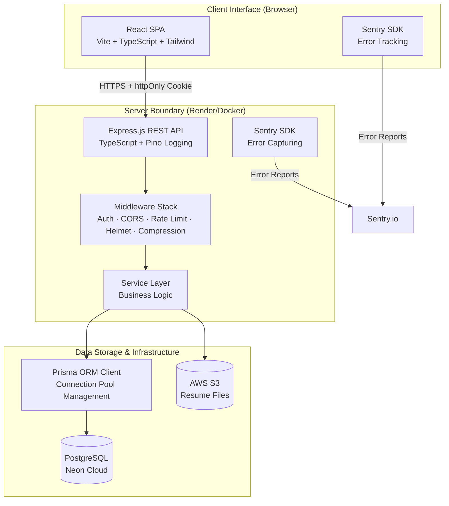
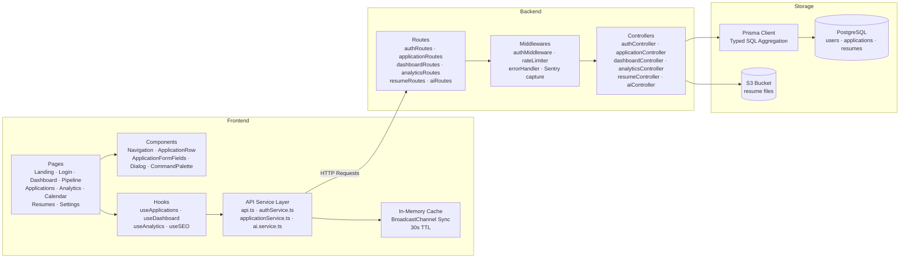
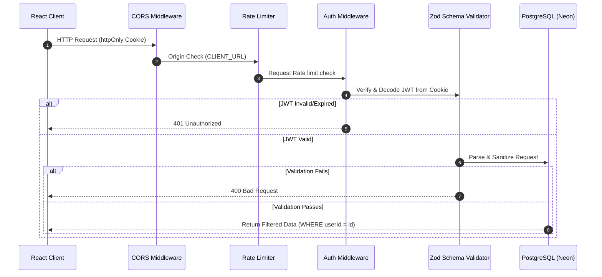
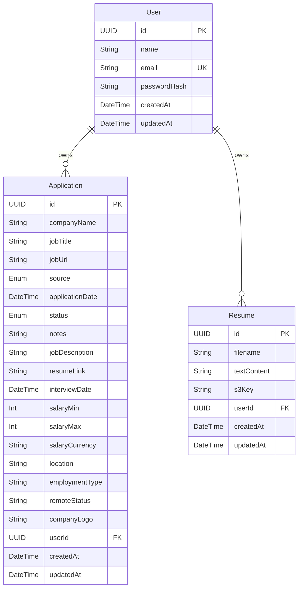

# 🎯 CareerTrack Lite

<div align="center">


[](https://github.com/mdadeel/Career-Tracker/actions/workflows/ci.yml)
[](https://codecov.io/gh/mdadeel/Career-Tracker)

[](https://vitejs.dev)
[](https://react.dev)
[](https://www.typescriptlang.org)
[](https://tailwindcss.com)
[](https://expressjs.com)
[](https://nodejs.org)
[](https://www.postgresql.org)
[](https://www.prisma.io)
[](https://vitest.dev)
[](https://playwright.dev)
[](https://docker.com)
[](https://sentry.io)
[](https://github.com/features/actions)
[](https://jwt.io)
[](https://vercel.com)
[](https://render.com)
[](https://neon.tech)
[](https://aws.amazon.com/s3/)

> A production-grade, highly secure, and responsive job application tracking SaaS. Register, log every application, track it through a visual pipeline, analyze metrics, and prepare for interviews using AI tools — all in one dashboard.

**Test Suite Status:** 🟢 52 Client Tests · 🟢 11 Server Tests · 🟢 5 E2E Playwright Tests — All Passing

</div>

---

## 📖 Table of Contents

<div align="center">

| ⚡ Getting Started | 🏗️ Architecture & Ops | 📋 Reference |
|:---:|:---:|:---:|
| [🚀 Local Setup](#-local-setup--installation) | [📐 System Architecture](#-system-architecture) | [📡 API Reference](#-api-reference) |
| [🔧 Environment Variables](#-environment-variables-reference) | [🔒 Security Architecture](#-security-architecture) | [📊 Data Models](#-data-models) |
| [🧪 Testing Suite](#-testing-suite) | [🛠️ Tech Stack](#️-tech-stack) | [📂 Project Structure](#-project-structure) |
| [🚢 Production Deployment](#-production-deployment) | [📦 CI/CD Pipeline](#-cicd-pipeline) | [✨ Core Features](#-core-features) |
| | [🐳 Docker Deployment](#-docker-deployment) | [🧬 Advanced Patterns](#-advanced-application-patterns) |
| | [🤖 AI Integration Engine](#-ai-integration-engine) | |
| | [🏗️ Infrastructure](#️-infrastructure--operations) | |

</div>

---

## ✨ Core Features

<div align="center">

| | | |
|:---:|:---:|:---:|
| 🔒 **httpOnly Cookie Auth**<br/><sub>XSS-protected JWT sessions via secure httpOnly cookies. `SameSite=None; Secure` in production.</sub> | 📋 **Full CRUD Metadata**<br/><sub>Salary ranges, location, employment type, remote status, JDs, resume links, custom notes.</sub> | 📊 **Dashboard & KPIs**<br/><sub>Real-time summaries via SQL aggregation. Total Apps, Interview Count, Offers, Response Rate.</sub> |
| 🎛️ **Kanban Pipeline**<br/><sub>6-stage drag-and-drop with `@dnd-kit` spring animations: Saved → Applied → Assessment → Interview → Offer → Rejected.</sub> | 📈 **Analytics & Charts**<br/><sub>4 interactive Recharts diagrams — velocity, funnel, source effectiveness, status distribution. Typed SQL backend.</sub> | 📅 **Interview Calendar**<br/><sub>Monthly grid view displaying all scheduled interviews and application deadlines at a glance.</sub> |
| 📎 **S3 Resume Uploads**<br/><sub>Upload to AWS S3 with signed, time-limited download URLs. Falls back gracefully to text-only storage.</sub> | 🛠️ **Bento 2.0 Matrix**<br/><sub>Asymmetric animated layout: Pipeline, `Cmd+K` palette, countdowns, funnels, and JD Vault.</sub> | 🎮 **Sandbox Mode**<br/><sub>Visitors explore search and filters on real-world mock data before registering.</sub> |
| ⚡ **Premium UX**<br/><sub>`Cmd+K` palette, debounced inputs, localStorage drafts, 30s TTL cache with BroadcastChannel cross-tab sync, high-contrast dark-first design system.</sub> | 🔍 **SEO & Metadata**<br/><sub>Helmet-driven OG tags, JSON-LD structured data (`SoftwareApplication`, `FAQPage` schemas).</sub> | 🚀 **Optimized Queries**<br/><sub>`groupBy` + typed `$queryRaw` aggregation instead of `findMany`. Rows → aggregates instantly.</sub> |

</div>

---

## 🛠️ Tech Stack

<div align="center">

### 🎨 Frontend

| | | | |
|:---:|:---:|:---:|:---:|
| <a href="https://react.dev"></a> | <a href="https://typescriptlang.org"></a> | <a href="https://vitejs.dev"></a> | <a href="https://tailwindcss.com"></a> |
| <a href="https://reactrouter.com"></a> | <a href="https://recharts.org"></a> | <a href="https://dndkit.com"></a> | <a href="https://phosphoricons.com"></a> |

### ⚙️ Backend

| | | | |
|:---:|:---:|:---:|:---:|
| <a href="https://expressjs.com"></a> | <a href="https://nodejs.org"></a> | <a href="https://zod.dev"></a> | <a href="https://getpino.io"></a> |
| <a href="https://helmetjs.github.io"></a> | <a href="https://jwt.io"></a> | <a href="https://github.com/expressjs/cookie-parser"></a> | <a href="https://expressjs.com"></a> |

### 🗄️ Data & Storage

| | | | |
|:---:|:---:|:---:|:---:|
| <a href="https://postgresql.org"></a> | <a href="https://prisma.io"></a> | <a href="https://neon.tech"></a> | <a href="https://aws.amazon.com/s3/"></a> |

### 🧪 Testing & CI/CD

| | | | |
|:---:|:---:|:---:|:---:|
| <a href="https://vitest.dev"></a> | <a href="https://playwright.dev"></a> | <a href="https://github.com/features/actions"></a> | <a href="https://docker.com"></a> |

### 📊 Monitoring & Deployment

| | | | |
|:---:|:---:|:---:|:---:|
| <a href="https://sentry.io"></a> | <a href="https://vercel.com"></a> | <a href="https://render.com"></a> |  |

</div>

---

## 📐 System Architecture

CareerTrack Lite operates as a decoupled, stateless SPA-API web application.



### Component Flow



---

## 🔒 Security Architecture

CareerTrack Lite implements a multi-layered security strategy aligning with the OWASP Top 10 guidelines.



### Key Security Implementations

*   **🍪 httpOnly Cookie JWT** — Tokens are served as `httpOnly` cookies (not accessible via `document.cookie`), protecting against XSS attacks. In production, cookies use `Secure=true` and `SameSite=None`.
*   **🔑 Strict SQL Parameterization** — All database queries are executed via Prisma's client wrapper, which auto-parameterizes values to prevent SQL injection.
*   **🛡️ Cryptographic Salted Hashing** — Passwords are hashed server-side with `bcrypt` (10 rounds). Raw passwords are never stored, logged, or returned in API responses.
*   **🎫 Stateless JWT Credentials** — Session authorization relies on JWTs signed with `HS256`. The payload contains only the non-sensitive fields `userId` and `email`. Tokens expire in 24 hours (configurable via `JWT_EXPIRY`).
*   **🚦 Endpoint Rate Limiting** — Express rate limit rules:
    *   `POST /api/auth/login`: Max 15 attempts per 15 minutes (brute-force defense, configurable).
    *   `POST /api/auth/register`: Max 5 accounts per hour.
    *   `GET /api/auth/me`: Max 50 requests per 15 minutes.
    *   Global API: Max 100 requests per 15 minutes.
*   **🧬 Contextual Data Isolation** — All CRUD operations are scoped using authorization headers:
    ```typescript
    // server/src/services/application-service.ts
    const apps = await prisma.application.findMany({
      where: { userId: req.user.userId }
    });
    ```
*   **📦 HTTP Security Headers** — `helmet` sets headers to block MIME-type sniffing (`nosniff`), disable iframe embedding (`DENY` to protect against clickjacking), and limit referrers.
*   **🔍 Sentry Error Monitoring** — Unexpected server errors are automatically captured and sent to Sentry (when configured), with stack traces stripped in production responses.

---

## 📡 API Reference

<div align="center">

**Base Endpoint:** `https://your-api.com/api`  ·  Auth via **httpOnly Cookie** (no Bearer tokens)

</div>

<details open>
<summary><b>🔐 1. Authentication</b>  <code>/api/auth</code></summary>

| Method | Endpoint | Auth | Description |
|:------:|:---------|:----:|:------------|
| <span style="color:#22c55e">●</span> POST | `/register` | — | Register a new account. JWT set as httpOnly cookie. |
| <span style="color:#22c55e">●</span> POST | `/login` | — | Authenticate credentials. JWT set as httpOnly cookie. |
| <span style="color:#3b82f6">●</span> GET | `/me` | ✅ | Get profile for the currently logged-in user. |
| <span style="color:#eab308">●</span> PATCH | `/password` | ✅ | Update password (requires current password). |
| <span style="color:#eab308">●</span> PATCH | `/resume` | ✅ | Set the user's active resume. |
| <span style="color:#eab308">●</span> PATCH | `/ai-config` | ✅ | Configure custom AI model settings. |
| <span style="color:#ef4444">●</span> POST | `/logout` | — | Clear the auth cookie. |

> 🔒 **Auth Note:** Sessions use **httpOnly cookies**, not Bearer tokens. The JWT is automatically sent with every request by the browser. No client-side token management needed.

</details>

<details>
<summary><b>📋 2. Applications</b>  <code>/api/applications</code></summary>

| Method | Endpoint | Auth | Description |
|:------:|:---------|:----:|:------------|
| <span style="color:#3b82f6">●</span> GET | `/` | ✅ | List applications. Supports `search`, `status`, `source`, `sortBy` query params. |
| <span style="color:#3b82f6">●</span> GET | `/:id` | ✅ | Get a single application by UUID. |
| <span style="color:#22c55e">●</span> POST | `/` | ✅ | Create a new application entry. |
| <span style="color:#eab308">●</span> PATCH | `/:id` | ✅ | Update an application (ownership verified). |
| <span style="color:#ef4444">●</span> DELETE | `/:id` | ✅ | Delete an application. |

```
GET /api/applications?search=engineer&status=Interview&source=LinkedIn&sortBy=newest
```

</details>

<details>
<summary><b>📎 3. Resumes</b>  <code>/api/resumes</code></summary>

| Method | Endpoint | Auth | Description |
|:------:|:---------|:----:|:------------|
| <span style="color:#3b82f6">●</span> GET | `/` | ✅ | List all user's uploaded resumes. |
| <span style="color:#3b82f6">●</span> GET | `/:id` | ✅ | Get a single resume by ID. |
| <span style="color:#22c55e">●</span> POST | `/upload` | ✅ | Upload resume (multipart). Stores in S3 if configured, otherwise extracts text. |
| <span style="color:#eab308">●</span> PATCH | `/:id` | ✅ | Update a resume (e.g. filename, text content). |
| <span style="color:#ef4444">●</span> DELETE | `/:id` | ✅ | Delete a resume. |

```json
{
  "success": true,
  "data": {
    "id": "uuid",
    "filename": "my-resume.pdf",
    "fileUrl": "https://s3-bucket.s3.amazonaws.com/...",
    "s3Key": "resumes/uuid/file.pdf",
    "textContent": "PDF text extraction...",
    "createdAt": "2024-01-15T10:30:00Z"
  }
}
```

> When S3 is configured, the response includes `fileUrl` (a signed, time-limited URL) and `s3Key`. Otherwise, only `textContent` is returned.

</details>

<details>
<summary><b>📊 4. Dashboard & Analytics</b>  <code>/api/dashboard</code> / <code>/api/analytics</code></summary>

| Method | Endpoint | Auth | Description |
|:------:|:---------|:----:|:------------|
| <span style="color:#3b82f6">●</span> GET | `/dashboard/stats` | ✅ | KPI summary counts + 5 most recent application logs. Uses SQL aggregation. |
| <span style="color:#3b82f6">●</span> GET | `/analytics/stats` | ✅ | Monthly trends, funnel dropoffs, source effectiveness via typed raw SQL queries. |

```json
{
  "success": true,
  "data": {
    "metrics": {
      "totalApplications": 24,
      "interviewRate": 16.6,
      "offerRate": 8.3
    },
    "monthlyTrends": [
      { "month": "Jan", "count": 2 },
      { "month": "Feb", "count": 4 }
    ]
  }
}
```

</details>

<details>
<summary><b>🤖 5. AI Services</b>  <code>/api/ai</code></summary>

| Method | Endpoint | Auth | Description |
|:------:|:---------|:----:|:------------|
| <span style="color:#22c55e">●</span> POST | `/parse-jd` | ✅ | Parse raw job description into structured fields. |
| <span style="color:#22c55e">●</span> POST | `/test-config` | ✅ | Test connection for custom AI model config. |
| <span style="color:#22c55e">●</span> POST | `/match-score/:id` | ✅ | Match resume vs. job description → match % + skill gaps. |
| <span style="color:#22c55e">●</span> POST | `/interview-prep/:id` | ✅ | Generate 5 STAR-method interview questions + tips. |
| <span style="color:#22c55e">●</span> POST | `/generate-email` | ✅ | Draft follow-up, thank-you, or cold outreach templates. |

</details>

<details>
<summary><b>💚 6. Health Check</b>  <code>/api/health</code></summary>

| Method | Endpoint | Auth | Description |
|:------:|:---------|:----:|:------------|
| <span style="color:#3b82f6">●</span> GET | `/health` | — | Server status, uptime, memory, version info. |

```json
{
  "status": "ok",
  "uptime": 12345.67,
  "version": "1.0.0",
  "memory": {
    "rss": 123456789,
    "heapTotal": 98765432,
    "heapUsed": 45678901
  },
  "timestamp": "2024-01-15T10:30:00Z"
}
```

</details>

---

## 📊 Data Models

Schema mapped through Prisma PostgreSQL types:



---

## 🏗️ Infrastructure & Operations

### 📦 CI/CD Pipeline

The project includes a **GitHub Actions** workflow (`.github/workflows/ci.yml`) that runs automatically on push and PR to the `main` branch:

| Stage | What It Does |
|:------|:-------------|
| **Server Tests** | Spins up a PostgreSQL 16 service container, pushes the Prisma schema (`prisma db push`), and executes all 11 server unit tests. |
| **Client Tests** | Runs all 52 client unit tests with Vitest (includes a `tsc --noEmit` type check) and uploads coverage to **Codecov**. |
| **Server TypeScript** | Type-checks the full `server/` codebase. |
| **Build Verification** | Builds both `server/` (`tsc`) and `client/` (Vite production build), then verifies the `dist` artifacts. |

### 🐳 Docker Deployment

A multi-stage `Dockerfile` is provided at the project root for containerized deployments:

```dockerfile
# ── Build Stage ──
FROM node:20-alpine AS builder

WORKDIR /app

# Install build dependencies for Prisma
RUN apk add --no-cache openssl

# Copy package files and install dependencies
COPY server/package.json server/package-lock.json ./
RUN npm ci

# Copy Prisma schema and generate client
COPY server/prisma ./prisma
RUN npx prisma generate

# Copy source and build
COPY server/tsconfig.json server/tsconfig.build.json ./
COPY server/src ./src
RUN npm run build

# ── Production Stage ──
FROM node:20-alpine AS production

WORKDIR /app

# Install only production dependencies
COPY server/package.json server/package-lock.json ./
RUN npm ci --production

# Copy Prisma client from builder (needed at runtime)
COPY --from=builder /app/node_modules/.prisma ./node_modules/.prisma
COPY --from=builder /app/prisma ./prisma

# Copy compiled output
COPY --from=builder /app/dist ./dist

# Expose the API port
EXPOSE 5000

# Health check
HEALTHCHECK --interval=30s --timeout=3s --start-period=10s --retries=3 \
  CMD wget --no-verbose --tries=1 --spider http://localhost:5000/api/health || exit 1

# Run the server
CMD ["node", "dist/server.js"]
```

Build and run with:
```bash
docker build -t careertrack-server .
docker run -p 5000:5000 --env-file server/.env careertrack-server
```

### 📊 Monitoring & Error Tracking

**Sentry** is integrated on both server and client (optional — requires a Sentry DSN):

- **Server**: `@sentry/node` initialized at startup. Uncaught exceptions in the error handler middleware are automatically captured with full stack traces.
- **Client**: `@sentry/react` initialized with `browserTracingIntegration`. A `<Sentry.ErrorBoundary>` wraps the app with a custom fallback UI.
- **Configuration**: Set `SENTRY_DSN` (server) and `VITE_SENTRY_DSN` (client). Gracefully disabled when no DSN is configured.

### 🗄️ Database Connection Pooling

Prisma client is configured with opt-in connection pooling via the `PRISMA_POOL_SIZE` env var:

```typescript
// server/src/utils/prisma.ts
const poolConfig = process.env.PRISMA_POOL_SIZE;
if (poolConfig) {
  url += `&connection_limit=${poolConfig}`;
}
```

In development, the Prisma client is cached globally to avoid hot-reload connection leaks.

---

## 🧬 Advanced Application Patterns

<blockquote>
The codebase features three advanced UX patterns that ensure rapid interactions, data safety, and premium usability.
</blockquote>

<table>
<tr>
<td width="33%" align="center" valign="top">

<h3>🔄 Optimistic CRUD</h3>
<p><small><b>Instant UI · Background Sync · Auto-Rollback</b></small></p>
<hr/>
<p>The <code>useApplications</code> hook implements optimistic updates:</p>
<ol>
<li><b>UI updates instantly</b> based on expected result</li>
<li><b>HTTP request fires</b> in the background</li>
<li><b>On success</b> — state reconciled</li>
<li><b>On failure</b> — snapshot rollback + toast</li>
</ol>

</td>
<td width="33%" align="center" valign="top">

<h3>🗄️ Smart Cache</h3>
<p><small><b>30s TTL · Auto-Invalidation · Cross-Tab Sync</b></small></p>
<hr/>
<p>In-memory <code>Map&lt;string, CacheEntry&gt;</code> with:</p>
<ul>
<li><b>30-second TTL</b> per cached response</li>
<li><b>Auto-invalidation</b> on POST/PATCH/DELETE</li>
<li><b>BroadcastChannel API</b> syncs across browser tabs</li>
</ul>

</td>
<td width="33%" align="center" valign="top">

<h3>💾 Draft Auto-Save</h3>
<p><small><b>1.5s Debounce · 24h Expiry · localStorage</b></small></p>
<hr/>
<p>Form components preserve unfinished work:</p>
<ul>
<li><b>1.5-second debounced</b> save to <code>localStorage</code></li>
<li><b>24-hour expiry</b> prevents stale data conflicts</li>
<li><b>Isolated keys</b> keep modal drafts separate from page drafts</li>
</ul>

</td>
</tr>
</table>

---

## 🤖 AI Integration Engine

The server includes a dedicated AI services wrapper ([ai.service.ts](server/src/services/ai.service.ts)) that supports multiple LLM providers.

```
       ┌────────────────────────┐
       │   AI SERVICE WRAPPER   │
       └───────────┬────────────┘
                   │
         ┌─────────┼─────────┬──────────────┐
         ▼         ▼         ▼              ▼
     [Gemini]   [OpenAI]  [OpenRouter]   [Custom]
         │         │         │              │
         └─────────┴────┬────┴──────────────┘
                        ▼
            [Pollinations AI Fallback]
```

### Supported Providers
1.  **Google Gemini** — Direct API connectivity (`gemini-2.5-flash` or custom configurations).
2.  **OpenAI** — Official API client compatibility (`gpt-4o-mini`, etc.).
3.  **OpenRouter** — High-availability gateway integration.
4.  **Custom Endpoints** — Connects to local or custom OpenAI-compatible proxies (e.g., Ollama, LM Studio).
5.  **Pollinations AI** — Zero-config system-default fallback ensuring all AI features work out-of-the-box without requiring an API key.

### Core Features
*   **📄 Job Spec Parser (`POST /api/ai/parse-jd`)** — Parses raw job description copy-paste blocks into structured schema fields.
*   **🎯 Resume-to-JD Matcher (`POST /api/ai/match-score/:id`)** — Compares the user's saved resume text against a job description, calculating a match percentage and extracting missing vs. matching skills.
*   **💬 Interview Prep Generator (`POST /api/ai/interview-prep/:id`)** — Generates 5 realistic behavioral, technical, and situational interview questions with tips based on the STAR method.
*   **✉️ Professional Outreach Drafter (`POST /api/ai/generate-email`)** — Drafts templates for job application follow-ups, thank-you notes, or cold outreach emails.

---

## 📂 Project Structure

```
task/
├── .github/
│   └── workflows/ci.yml           # GitHub Actions CI/CD pipeline (4 jobs)
├── Dockerfile                      # Multi-stage production build (server)
├── client/                         # Vite + React Client
│   ├── e2e/                        # Playwright E2E tests (5 tests)
│   ├── scripts/                    # Icon generation scripts
│   ├── src/
│   │   ├── components/             # Feature components
│   │   │   ├── ui/                 # Reusable design primitives (Button, Input, Dialog, Sidebar…)
│   │   │   ├── CommandPalette      # Global `Cmd+K` navigation palette
│   │   │   ├── AiAssistantDrawer   # AI interview & email assistant drawer
│   │   │   └── ResumeManager       # Resume upload & selector flows
│   │   ├── constants/              # Select options, menus, and status colors
│   │   ├── context/                # Context providers (Auth, Toast notifications)
│   │   ├── hooks/                  # Custom hooks (optimistic CRUD, dashboard, analytics, SEO)
│   │   ├── pages/                  # Route components (Dashboard, Pipeline, Calendar, Analytics…)
│   │   ├── seo/                    # Per-page metadata, JSON-LD schemas, site config
│   │   ├── services/               # API layers (cache with BroadcastChannel sync, fetch handlers)
│   │   ├── test/                   # Vitest setup
│   │   ├── types/                  # Shared TypeScript types
│   │   └── utils/                  # Text parsing and layout formatters
│   ├── tailwind.config.js          # Brand design system tokens (dark, sky-blue accent)
│   └── vite.config.ts              # Proxy dev configuration + gzip/brotli compression
│
└── server/                         # Node.js + Express API
    ├── prisma/
    │   ├── schema.prisma           # Schema (User, Application, Resume)
    │   ├── migrations/             # Database migrations
    │   └── seed.ts                 # Demo data seeder (24 applications)
    └── src/
        ├── controllers/            # Express handlers (auth, applications, analytics, AI, resumes)
        ├── docs/                   # Swagger API documentation
        ├── lib/                    # Shared libraries (resumeParser)
        ├── middlewares/            # Security protections & rate limit filters
        │   ├── auth-middleware.ts   # JWT cookie verification
        │   ├── error-handler.ts    # Centralized error handling + Sentry capture
        │   └── rate-limiter.ts     # Per-endpoint rate limiting
        ├── routes/                 # Path definitions (includes health check)
        ├── services/               # Service layers (typed SQL aggregation, S3, AI)
        ├── types/                  # Shared server types
        ├── utils/
        │   ├── prisma.ts           # Prisma client with connection pool management
        │   ├── s3.ts               # S3 upload/signed URL utilities
        │   ├── token.ts            # JWT sign/verify
        │   └── password.ts         # bcrypt hash/verify
        └── server.ts               # HTTP server bootstrapping + Sentry init
```

---

## 🚀 Local Setup & Installation

### Prerequisites
*   **Node.js** v18 or newer
*   **npm** v9 or newer
*   A **PostgreSQL** database (e.g., from [Neon.tech](https://neon.tech))

### Installation Steps

1.  **Clone the Repository:**
    ```bash
    git clone https://github.com/mdadeel/Career-Tracker.git
    cd Career-Tracker
    ```

2.  **Install Server Dependencies:**
    ```bash
    cd server
    npm install
    ```

3.  **Install Client Dependencies:**
    ```bash
    cd ../client
    npm install
    ```

4.  **Configure Environment:**
    Copy and customize the environment files:
    ```bash
    # Server
    cp server/.env.example server/.env
    # Edit server/.env with your database URL and JWT secret

    # Client
    cp client/.env.example client/.env
    # Edit client/.env with your API URL
    ```

5.  **Set Up Database:**
    ```bash
    cd server
    npx prisma generate
    npx prisma migrate dev --name init
    ```

6.  **Seed Demo Data:**
    Populates the database with a test user and 24 realistic applications across 7 months (Stripe, Notion, Cal.com, Fly.io, etc.):
    ```bash
    npm run db:seed
    ```

    > [!IMPORTANT]
    > **Default Seed Credentials:**
    > *   **Email:** `demo@careertrack.app`
    > *   **Password:** `demo@123`

7.  **Start Development Servers:**
    ```bash
    # Terminal 1 — Server (port 5000)
    cd server && npm run dev

    # Terminal 2 — Client (port 5173)
    cd client && npm run dev
    ```

---

## 🧪 Testing Suite

### Unit & Integration Tests

```bash
# Server tests (11 tests — token auth, resume parser)
cd server
npm test

# Client tests (52 tests — components, hooks, services, utils)
cd client
npm test

# Client tests with coverage
cd client && npm run test:coverage
```

### End-to-End Tests (Playwright)

5 E2E tests covering the full user journey:

| Test | What It Validates |
|:-----|:------------------|
| **1. Register → Dashboard** | New user registration, redirect, dashboard loads |
| **2. Login → Dashboard stats** | Seed user login, KPI cards render |
| **3. Create application → List** | Full application creation flow, appears in list |
| **4. Analytics page** | Charts and analytics widgets render |
| **5. Full app tour** | All 7 protected routes (Pipeline → Calendar → Analytics → Settings → Dashboard) |

```bash
# Ensure both servers are running first, then:
cd client
npx playwright test
```

---

## 🔧 Environment Variables Reference

### Server (`server/.env`)

| Variable | Required | Default | Description |
|----------|----------|---------|-------------|
| `DATABASE_URL` | ✅ **Yes** | — | PostgreSQL connection string (with connection pooler for Neon) |
| `DIRECT_URL` | ✅ **Yes** | — | Direct (non-pooled) connection string for Prisma migrations (`directUrl` in schema) |
| `JWT_SECRET` | ✅ **Yes** | — | Generate with `openssl rand -hex 64` |
| `CLIENT_URL` | ✅ **Yes** | — | Frontend URL for CORS (e.g. `http://localhost:5173`) |
| `NODE_ENV` | ✅ **Yes** | — | Set to `production` in production; `development` locally |
| `PORT` | ❌ No | `5000` | Server port |
| `JWT_EXPIRY` | ❌ No | `24h` | Token expiration (e.g. `7d` for longer sessions) |
| `LOG_LEVEL` | ❌ No | `info` | Pino log level (`info`, `warn`, `error`, `debug`) |
| `AUTH_RATE_LIMIT_MAX` | ❌ No | `15` | Login attempts per 15-min window (production) |
| `PRISMA_POOL_SIZE` | ❌ No | — | Connection pool size (injected into `DATABASE_URL`) |
| `SENTRY_DSN` | ❌ No | — | Sentry project DSN for error monitoring |
| `SENTRY_TRACES_SAMPLE_RATE` | ❌ No | `0.1` | Sentry traces sample rate (0–1) |
| `S3_BUCKET` | ❌ No | — | S3 bucket name for resume file uploads |
| `S3_REGION` | ❌ No | `us-east-1` | AWS region for S3 bucket |
| `S3_ACCESS_KEY_ID` | ❌ No | — | AWS access key for S3 |
| `S3_SECRET_ACCESS_KEY` | ❌ No | — | AWS secret key for S3 |
| `POLLINATIONS_API_KEY` | ❌ No | — | AI fallback service API key |

### Client (`client/.env`)

| Variable | Required | Default | Description |
|----------|----------|---------|-------------|
| `VITE_API_URL` | ✅ **Yes** | — | Server API base URL (e.g. `http://localhost:5000/api`) |
| `VITE_SENTRY_DSN` | ❌ No | — | Sentry project DSN for client error monitoring |

---

## 🚢 Production Deployment

### Option A: Render (Server) + Vercel (Client) + Neon (Database)

#### 1. Server API Deployed to Render
1.  Create a new **Web Service** pointing to your repository.
2.  Set the Root Directory to `server/`.
3.  Configure the build commands:
    ```bash
    npm install && npx prisma generate && npm run build
    ```
4.  Configure the start command:
    ```bash
    npm start
    ```
5.  Set database migration scripts as a Release Command:
    ```bash
    npx prisma migrate deploy
    ```
6.  Set up environment variables: `DATABASE_URL`, `DIRECT_URL`, `JWT_SECRET`, `JWT_EXPIRY`, `CLIENT_URL` (points to the client domain), and any optional vars (Sentry, S3, etc.).

#### 2. Client SPA Deployed to Vercel
1.  Import your project on the Vercel Dashboard.
2.  Set the root folder path to `client/`.
3.  Configure the Build Command: `npm run build`.
4.  Configure the Output Directory: `dist`.
5.  Add the environment variable `VITE_API_URL` pointing to your deployed API server endpoint (`https://your-api.onrender.com/api`).

### Option B: Docker (Any Cloud)

Build and run the server as a Docker container on any Docker-compatible hosting (AWS ECS, Google Cloud Run, Railway, etc.):

```bash
docker build -t careertrack-server .
docker run -p 5000:5000 \
  -e DATABASE_URL=... \
  -e JWT_SECRET=... \
  -e CLIENT_URL=https://your-client.com \
  -e NODE_ENV=production \
  careertrack-server
```

### ⚠️ Production Checklist

- [ ] Generate a strong `JWT_SECRET` (`openssl rand -hex 64`)
- [ ] Set `NODE_ENV=production`
- [ ] Run `npx prisma migrate deploy` to apply all migrations
- [ ] Configure `SENTRY_DSN` for error monitoring
- [ ] Set `CLIENT_URL` to your production client domain
- [ ] Verify CORS works with your deployed client URL
- [ ] Run E2E tests against the production environment
- [ ] Configure S3 bucket CORS policy for your client domain (if using resume uploads)

---

## 🎓 Author & Submission Credits

*   **Project Name:** CareerTrack Lite
*   **Author:** Shahnawas Adeel
*   **Repository:** [github.com/mdadeel/Career-Tracker](https://github.com/mdadeel/Career-Tracker)
