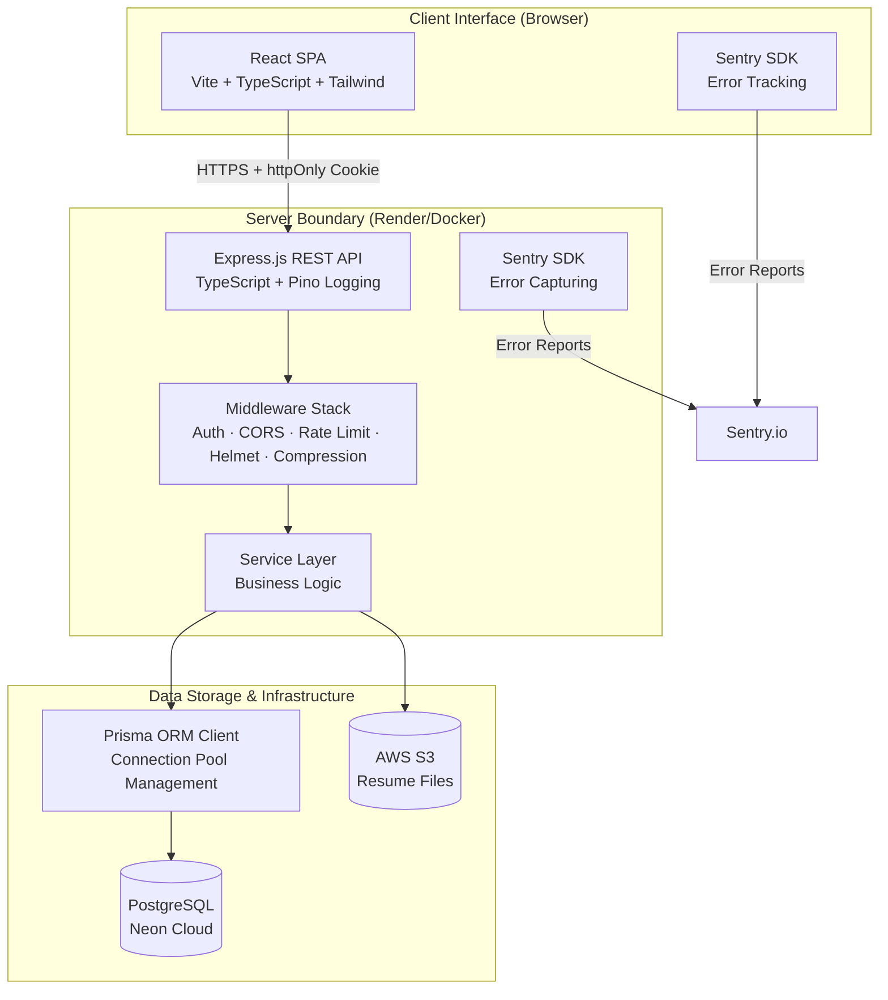
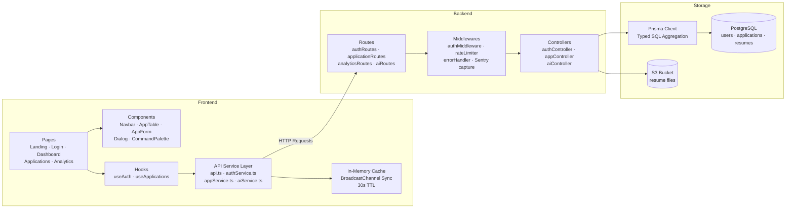
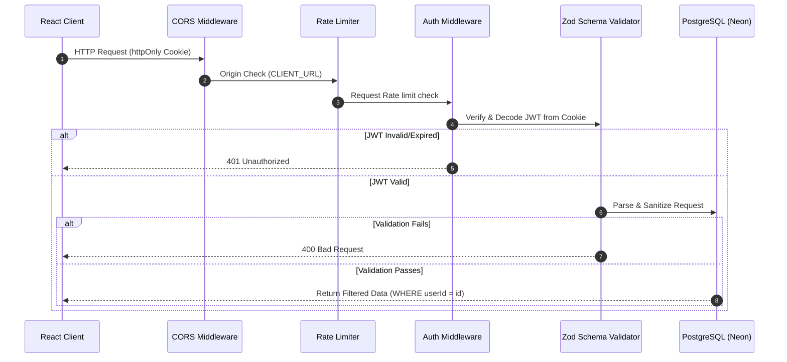
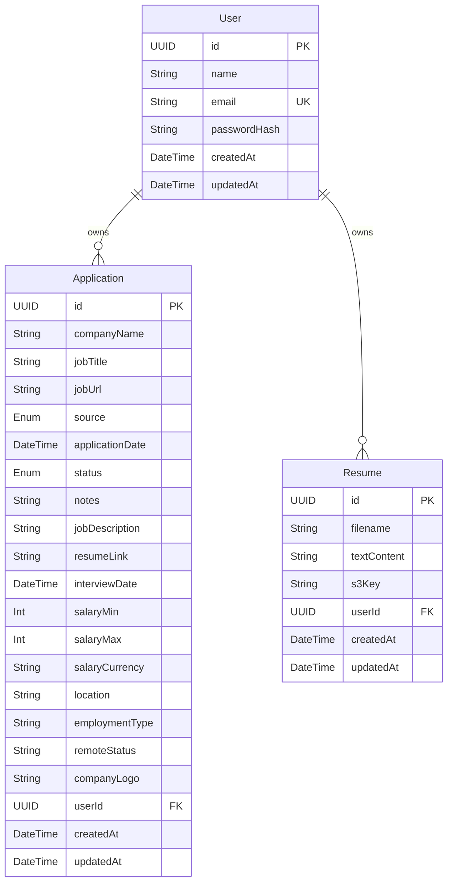

# 🎯 CareerTrack Lite

<div align="center">


[](https://vitejs.dev)
[](https://react.dev)
[](https://www.typescriptlang.org)
[](https://tailwindcss.com)
[](https://expressjs.com)
[](https://nodejs.org)
[](https://www.postgresql.org)
[](https://www.prisma.io)
[](https://vitest.dev)
[](https://playwright.dev)
[](https://docker.com)
[](https://sentry.io)
[](https://github.com/features/actions)
[](https://jwt.io)
[](https://vercel.com)
[](https://render.com)
[](https://neon.tech)
[](https://aws.amazon.com/s3/)

> A production-grade, highly secure, and responsive job application tracking SaaS. Register, log every application, track it through a visual pipeline, analyze metrics, and prepare for interviews using AI tools — all in one dashboard.

**Test Suite Status:** 🟢 42 Client Tests · 🟢 11 Server Tests · 🟢 5 E2E Playwright Tests — All Passing

</div>

---

## 📖 Table of Contents
- [✨ Core Features](#-core-features)
- [🛠️ Tech Stack](#️-tech-stack)
- [📐 System Architecture](#-system-architecture)
- [🔒 Security Architecture](#-security-architecture)
- [📡 API Reference](#-api-reference)
- [📊 Data Models](#-data-models)
- [🏗️ Infrastructure & Operations](#️-infrastructure--operations)
- [📦 CI/CD Pipeline](#-cicd-pipeline)
- [🐳 Docker Deployment](#-docker-deployment)
- [🤖 AI Integration Engine](#-ai-integration-engine)
- [📂 Project Structure](#-project-structure)
- [🚀 Local Setup & Installation](#-local-setup--installation)
- [🧪 Testing Suite](#-testing-suite)
- [🔧 Environment Variables Reference](#-environment-variables-reference)
- [🚢 Production Deployment](#-production-deployment)
- [🎓 Author & Submission Credits](#-author--submission-credits)

---

## ✨ Core Features

*   **🔒 httpOnly Cookie JWT Authentication** — XSS-protected session management. Tokens are stored in secure, httpOnly cookies (not localStorage), with `SameSite=None; Secure` in production for cross-origin support.
*   **📋 Full CRUD & Rich Application Metadata** — Store salary ranges ($ min/max/currency), location, employment type, remote status, full job descriptions (JDs), resume links, and custom notes.
*   **📊 Interactive Dashboard & Metrics** — Real-time KPI summaries (Total Apps, Interview Count, Offers, Response Rate) using optimized SQL aggregation queries for instant load times.
*   **🎛️ Drag-and-Drop Pipeline (Kanban)** — Manage applications across 6 stages (`Saved`, `Applied`, `Assessment`, `Interview`, `Offer`, `Rejected`) using a spring-animated column interface powered by `@dnd-kit`.
*   **📈 Deep Analytics & Visualizations** — 4 interactive Recharts diagrams charting monthly submission velocities, conversion funnels, source effectiveness, and status distributions — backed by typed raw SQL queries.
*   **📅 Interview Calendar** — Comprehensive month-view grid displaying scheduled interviews and application dates.
*   **📎 S3 Resume Uploads** — Upload and store resumes in AWS S3 (or compatible S3 storage). Downloads use signed, time-limited URLs. Gracefully falls back to text-only storage when S3 is not configured.
*   **🛠️ Bento 2.0 Feature Matrix** — An asymmetric layout with micro-animations showing dynamic features (Intelligent Pipeline, `Cmd+K` Command palette, Interview countdowns, Analytics funnels, and JD Vaults).
*   **🎮 Live Sandbox Mode** — Allows visitors on the landing page to experience search and status filters on real-world mock data before registering.
*   **⚡ Premium User Experience** — Ctrl+K command palette, debounced inputs, local storage drafts, **30s TTL in-memory cache with BroadcastChannel cross-tab sync**, responsive navigation (sidebar/mobile drawer), and full dark mode.
*   **🔍 SEO & Structured Metadata** — Helmet-driven document titles, OpenGraph tags, and JSON-LD structured data (`SoftwareApplication` and `FAQPage` schemas).
*   **📊 Optimized Query Performance** — Dashboard and analytics endpoints use Prisma `groupBy` and typed `$queryRaw` SQL aggregation instead of `findMany` + client-side compute, reducing data transfer from thousands of rows to a few aggregate values.

---

## 🛠️ Tech Stack

| Layer | Technologies | Purpose |
| :--- | :--- | :--- |
| **Frontend** | React 18, TypeScript, Vite, Tailwind CSS v3, React Router v6, Recharts, `@dnd-kit`, `react-helmet-async`, `@phosphor-icons/react` | Client-side routing, state mutations, interactive charts, drag-and-drop pipelines, responsive templates. |
| **Backend** | Node.js, Express 4, TypeScript, Zod (validation), Helmet (headers), Express Rate Limit, **Pino (structured logging)**, **Compression (gzip/brotli)**, **Cookie-Parser** | REST API endpoints, user authentication, payload validation, server security, structured JSON logging, response compression. |
| **Database** | PostgreSQL (Neon Cloud) via Prisma ORM Client | Relational schema management, transactions, connection pooling (configurable via `PRISMA_POOL_SIZE`), and seeding. |
| **File Storage** | AWS S3 (or compatible) via `@aws-sdk/client-s3` | Resume file uploads. Signed URL downloads. Graceful fallback to text-only when S3 is not configured. |
| **Monitoring** | **Sentry** (`@sentry/node`, `@sentry/react`) | Production error tracking. Captures unhandled exceptions and React rendering errors. Disabled when no DSN is configured. |
| **Testing** | Vitest, Testing Library (React/Hooks), **Playwright (E2E)** | Component, helper, custom hooks and **full end-to-end Playwright tests covering all user flows**. |
| **CI/CD** | **GitHub Actions** | Automated test runs, TypeScript checks, and build verification on push and PR. |
| **Containerization** | **Docker** (multi-stage) | Production-ready Docker image with Prisma client generation. |
| **Hosting** | Vercel (Client) · Render (Server/API) · Neon (Database) | Production CI/CD pipelines. |

---

## 📐 System Architecture

CareerTrack Lite operates as a decoupled, stateless SPA-API web application.



### Component Flow



---

## 🔒 Security Architecture

CareerTrack Lite implements a multi-layered security strategy aligning with the OWASP Top 10 guidelines.



### Key Security Implementations

*   **🍪 httpOnly Cookie JWT** — Tokens are served as `httpOnly` cookies (not accessible via `document.cookie`), protecting against XSS attacks. In production, cookies use `Secure=true` and `SameSite=None`.
*   **🔑 Strict SQL Parameterization** — All database queries are executed via Prisma's client wrapper, which auto-parameterizes values to prevent SQL injection.
*   **🛡️ Cryptographic Salted Hashing** — Passwords are hashed server-side with `bcrypt` (10 rounds). Raw passwords are never stored, logged, or returned in API responses.
*   **🎫 Stateless JWT Credentials** — Session authorization relies on JWTs signed with `HS256`. The payload contains only the non-sensitive fields `userId` and `email`. Tokens expire in 24 hours (configurable via `JWT_EXPIRY`).
*   **🚦 Endpoint Rate Limiting** — Express rate limit rules:
    *   `POST /api/auth/login`: Max 15 attempts per 15 minutes (brute-force defense, configurable).
    *   `POST /api/auth/register`: Max 5 accounts per hour.
    *   `GET /api/auth/me`: Max 50 requests per 15 minutes.
    *   Global API: Max 100 requests per 15 minutes.
*   **🧬 Contextual Data Isolation** — All CRUD operations are scoped using authorization headers:
    ```typescript
    // server/src/services/application-service.ts
    const apps = await prisma.application.findMany({
      where: { userId: req.user.userId }
    });
    ```
*   **📦 HTTP Security Headers** — `helmet` sets headers to block MIME-type sniffing (`nosniff`), disable iframe embedding (`DENY` to protect against clickjacking), and limit referrers.
*   **🔍 Sentry Error Monitoring** — Unexpected server errors are automatically captured and sent to Sentry (when configured), with stack traces stripped in production responses.

---

## 📡 API Reference

Base Endpoint: `/api`

### 1. Authentication (`/api/auth`)
<details>
<summary>View Auth Endpoints</summary>

| Method | Endpoint | Auth | Description |
| :--- | :--- | :--- | :--- |
| `POST` | `/register` | – | Register a new account. JWT is set as an httpOnly cookie. |
| `POST` | `/login` | – | Authenticate credentials. JWT is set as an httpOnly cookie. |
| `GET` | `/me` | ✅ | Get profile details for the currently logged-in user. |
| `PATCH` | `/password` | ✅ | Update password (requires current password validation). |
| `POST` | `/logout` | – | Clear the auth cookie. |

> **Auth Note:** Authentication uses **httpOnly cookies**, not Bearer tokens. The JWT is automatically sent with every request by the browser. No client-side token management is needed.
</details>

### 2. Applications Management (`/api/applications`)
<details>
<summary>View Applications Endpoints</summary>

| Method | Endpoint | Auth | Description |
| :--- | :--- | :--- | :--- |
| `GET` | `/` | ✅ | Get user's applications (supports filtering via query params: `search`, `status`, `source`, `sortBy=newest\|oldest`). |
| `GET` | `/:id` | ✅ | Get a single application by UUID. |
| `POST` | `/` | ✅ | Create a new application entry. |
| `PATCH` | `/:id` | ✅ | Update an application. Verify ownership before saving. |
| `DELETE` | `/:id` | ✅ | Delete an application. |

#### Filter Query Example:
`GET /api/applications?search=engineer&status=Interview&source=LinkedIn&sortBy=newest`
</details>

### 3. Resume Management (`/api/resumes`)
<details>
<summary>View Resume Endpoints</summary>

| Method | Endpoint | Auth | Description |
| :--- | :--- | :--- | :--- |
| `GET` | `/` | ✅ | List all user's uploaded resumes. |
| `POST` | `/upload` | ✅ | Upload a new resume (multipart/form-data). Stores in S3 if configured, otherwise extracts text content. |
| `DELETE` | `/:id` | ✅ | Delete a resume. |

#### Upload Response Example:
```json
{
  "success": true,
  "data": {
    "id": "uuid",
    "filename": "my-resume.pdf",
    "fileUrl": "https://s3-bucket.s3.amazonaws.com/...?X-Amz-Signature=...",
    "s3Key": "resumes/uuid/file.pdf",
    "textContent": "PDF text extraction...",
    "createdAt": "2024-01-15T10:30:00Z"
  }
}
```
> When S3 is configured, the response includes `fileUrl` (a signed, time-limited URL) and `s3Key`. Otherwise, only `textContent` is returned and a download button is not shown in the UI.
</details>

### 4. Analytics & Dashboard (`/api/dashboard` & `/api/analytics`)
<details>
<summary>View Analytics Endpoints</summary>

| Method | Endpoint | Auth | Description |
| :--- | :--- | :--- | :--- |
| `GET` | `/dashboard/stats` | ✅ | Get quick KPI summary counts and the 5 most recent application logs. Uses SQL aggregation for performance. |
| `GET` | `/analytics/stats` | ✅ | Get detailed metrics (monthly submission rates, funnel dropoffs, application source yields) via typed raw SQL queries. |

```json
{
  "success": true,
  "data": {
    "metrics": {
      "totalApplications": 24,
      "interviewRate": 16.6,
      "offerRate": 8.3
    },
    "monthlyTrends": [
      { "month": "Jan", "count": 2 },
      { "month": "Feb", "count": 4 }
    ]
  }
}
```
</details>

### 5. AI Services Coordinator (`/api/ai`)
<details>
<summary>View AI Endpoints</summary>

| Method | Endpoint | Auth | Description |
| :--- | :--- | :--- | :--- |
| `POST` | `/parse-jd` | ✅ | Parses a raw job description string and returns structured info. |
| `POST` | `/test-config` | ✅ | Test connection for user-supplied custom AI models. |
| `POST` | `/match-score/:id` | ✅ | Match resume text against a saved application's JD. |
| `POST` | `/interview-prep/:id` | ✅ | Generate 5 interview questions and STAR-method answering tips. |
| `POST` | `/generate-email` | ✅ | Generate a follow-up or cold outreach email template. |
</details>

### 6. Health Check (`/api/health`)
<details>
<summary>View Health Endpoint</summary>

| Method | Endpoint | Auth | Description |
| :--- | :--- | :--- | :--- |
| `GET` | `/health` | – | Server health check with uptime, memory usage, and version info. |

```json
{
  "status": "ok",
  "uptime": 12345.67,
  "version": "1.0.0",
  "memory": {
    "rss": 123456789,
    "heapTotal": 98765432,
    "heapUsed": 45678901
  },
  "timestamp": "2024-01-15T10:30:00Z"
}
```
</details>

---

## 📊 Data Models

Schema mapped through Prisma PostgreSQL types:



---

## 🏗️ Infrastructure & Operations

### 📦 CI/CD Pipeline

The project includes a **GitHub Actions** workflow (`.github/workflows/ci.yml`) that runs automatically on push and PR to the `main` branch:

| Stage | What It Does |
|:------|:-------------|
| **Server Tests** | Spins up a PostgreSQL service container, runs `prisma migrate deploy`, and executes all 11 server unit tests. |
| **Client Tests** | Runs all 42 client unit tests with Vitest. |
| **TypeScript Checks** | Checks both `server/` and `client/` for type errors. |
| **Client Build** | Verifies the Vite production build succeeds. |

### 🐳 Docker Deployment

A multi-stage `Dockerfile` is provided at the project root for containerized deployments:

```dockerfile
# Stage 1: Build
FROM node:20-alpine AS builder
WORKDIR /app
COPY server/package*.json ./
RUN npm ci
COPY server/prisma ./prisma
RUN npx prisma generate
COPY server/ ./
RUN npm run build

# Stage 2: Production
FROM node:20-alpine AS runner
WORKDIR /app
COPY --from=builder /app/dist ./dist
COPY --from=builder /app/node_modules ./node_modules
COPY --from=builder /app/node_modules/.prisma ./node_modules/.prisma
COPY server/package*.json ./
RUN npm ci --production --ignore-scripts
HEALTHCHECK --interval=30s --timeout=3s --start-period=5s \
  CMD node -e "fetch('http://localhost:5000/api/health').then(r=>process.exit(r.ok?0:1))"
USER node
CMD ["node", "dist/server.js"]
```

Build and run with:
```bash
docker build -t careertrack-server .
docker run -p 5000:5000 --env-file server/.env careertrack-server
```

### 📊 Monitoring & Error Tracking

**Sentry** is integrated on both server and client (optional — requires a Sentry DSN):

- **Server**: `@sentry/node` initialized at startup. Uncaught exceptions in the error handler middleware are automatically captured with full stack traces.
- **Client**: `@sentry/react` initialized with `browserTracingIntegration`. A `<Sentry.ErrorBoundary>` wraps the app with a custom fallback UI.
- **Configuration**: Set `SENTRY_DSN` (server) and `VITE_SENTRY_DSN` (client). Gracefully disabled when no DSN is configured.

### 🗄️ Database Connection Pooling

Prisma client is configured with opt-in connection pooling via the `PRISMA_POOL_SIZE` env var:

```typescript
// server/src/utils/prisma.ts
const poolConfig = process.env.PRISMA_POOL_SIZE;
if (poolConfig) {
  url += `&connection_limit=${poolConfig}`;
}
```

In development, the Prisma client is cached globally to avoid hot-reload connection leaks.

---

## 🤖 AI Integration Engine

The server includes a dedicated AI services wrapper ([ai.service.ts](file:///home/adeel/Documents/projects/task/server/src/services/ai.service.ts)) that supports multiple LLM providers.

```
       ┌────────────────────────┐
       │   AI SERVICE WRAPPER   │
       └───────────┬────────────┘
                   │
         ┌─────────┼─────────┬──────────────┐
         ▼         ▼         ▼              ▼
     [Gemini]   [OpenAI]  [OpenRouter]   [Custom]
         │         │         │              │
         └─────────┴────┬────┴──────────────┘
                        ▼
            [Pollinations AI Fallback]
```

### Supported Providers
1.  **Google Gemini** — Direct API connectivity (`gemini-2.5-flash` or custom configurations).
2.  **OpenAI** — Official API client compatibility (`gpt-4o-mini`, etc.).
3.  **OpenRouter** — High-availability gateway integration.
4.  **Custom Endpoints** — Connects to local or custom OpenAI-compatible proxies (e.g., Ollama, LM Studio).
5.  **Pollinations AI** — Zero-config system-default fallback ensuring all AI features work out-of-the-box without requiring an API key.

### Core Features
*   **📄 Job Spec Parser (`POST /api/ai/parse-jd`)** — Parses raw job description copy-paste blocks into structured schema fields.
*   **🎯 Resume-to-JD Matcher (`POST /api/ai/match-score/:id`)** — Compares the user's saved resume text against a job description, calculating a match percentage and extracting missing vs. matching skills.
*   **💬 Interview Prep Generator (`POST /api/ai/interview-prep/:id`)** — Generates 5 realistic behavioral, technical, and situational interview questions with tips based on the STAR method.
*   **✉️ Professional Outreach Drafter (`POST /api/ai/generate-email`)** — Drafts templates for job application follow-ups, thank-you notes, or cold outreach emails.

---

## 📂 Project Structure

```
task/
├── .github/
│   └── workflows/ci.yml           # GitHub Actions CI/CD pipeline
├── Dockerfile                      # Multi-stage production build
├── client/                         # Vite + React Client
│   ├── e2e/                        # Playwright E2E tests (5 tests)
│   ├── src/
│   │   ├── components/             # Component architecture
│   │   │   ├── ui/                 # Reusable design primitives (Buttons, Inputs, Dialogs)
│   │   │   ├── CommandPalette      # Global navigations palette
│   │   │   └── SEOHead.tsx         # Dynamic SEO manager
│   │   ├── constants/              # Select options, menus, and paths
│   │   ├── context/                # Context providers (Auth, Toast notification)
│   │   ├── hooks/                  # Custom hooks (optimistic handlers, theme detectors)
│   │   ├── pages/                  # Route components (Kanban board, analytics, settings)
│   │   ├── services/               # Network request layers (cache with BroadcastChannel sync, fetch handlers)
│   │   └── utils/                  # Text parsing and layout formatters
│   ├── tailwind.config.js          # Brand design system tokens
│   └── vite.config.ts              # Proxy dev configurations + gzip/brotli compression
│
└── server/                         # Node.js + Express API
    ├── prisma/
    │   ├── schema.prisma           # Schema layout
    │   ├── migrations/             # Database migrations
    │   └── seed.ts                 # Demo data seeder
    └── src/
        ├── controllers/            # Express handlers (auth, analytics, AI, resumes)
        ├── middlewares/            # Security protections & rate limit filters
        │   ├── auth-middleware.ts   # JWT cookie verification
        │   ├── error-handler.ts    # Centralized error handling + Sentry capture
        │   └── rate-limiter.ts     # Per-endpoint rate limiting
        ├── routes/                 # Path definitions (includes health check)
        ├── services/               # Service layers (typed SQL aggregation, S3, AI)
        ├── utils/
        │   ├── prisma.ts           # Prisma client with connection pool management
        │   ├── s3.ts               # S3 upload/signed URL utilities
        │   ├── token.ts            # JWT sign/verify
        │   └── password.ts         # bcrypt hash/verify
        └── server.ts               # HTTP server bootstrapping + Sentry init
```

---

## 🚀 Local Setup & Installation

### Prerequisites
*   **Node.js** v18 or newer
*   **npm** v9 or newer
*   A **PostgreSQL** database (e.g., from [Neon.tech](https://neon.tech))

### Installation Steps

1.  **Clone the Repository:**
    ```bash
    git clone https://github.com/mdadeel/Career-Tracker.git
    cd Career-Tracker
    ```

2.  **Install Server Dependencies:**
    ```bash
    cd server
    npm install
    ```

3.  **Install Client Dependencies:**
    ```bash
    cd ../client
    npm install
    ```

4.  **Configure Environment:**
    Copy and customize the environment files:
    ```bash
    # Server
    cp server/.env.example server/.env
    # Edit server/.env with your database URL and JWT secret

    # Client
    cp client/.env.example client/.env
    # Edit client/.env with your API URL
    ```

5.  **Set Up Database:**
    ```bash
    cd server
    npx prisma generate
    npx prisma migrate dev --name init
    ```

6.  **Seed Demo Data:**
    Populates the database with a test user and 24 realistic applications across 7 months (Stripe, Notion, Cal.com, Fly.io, etc.):
    ```bash
    npm run db:seed
    ```

    > [!IMPORTANT]
    > **Default Seed Credentials:**
    > *   **Email:** `demo@careertrack.app`
    > *   **Password:** `demo@123`

7.  **Start Development Servers:**
    ```bash
    # Terminal 1 — Server (port 5000)
    cd server && npm run dev

    # Terminal 2 — Client (port 5173)
    cd client && npm run dev
    ```

---

## 🧪 Testing Suite

### Unit & Integration Tests

```bash
# Server tests (11 tests — auth, token, resume parser)
cd server
npm test

# Client tests (42 tests — components, hooks, services, utils)
cd client
npm test

# Client tests with coverage
cd client && npm run test:coverage
```

### End-to-End Tests (Playwright)

5 E2E tests covering the full user journey:

| Test | What It Validates |
|:-----|:------------------|
| **1. Register → Dashboard** | New user registration, redirect, dashboard loads |
| **2. Login → Dashboard stats** | Seed user login, KPI cards render |
| **3. Create application → List** | Full application creation flow, appears in list |
| **4. Analytics page** | Charts and analytics widgets render |
| **5. Full app tour** | All 7 protected routes (Pipeline → Calendar → Analytics → Settings → Dashboard) |

```bash
# Ensure both servers are running first, then:
cd client
npx playwright test
```

---

## 🔧 Environment Variables Reference

### Server (`server/.env`)

| Variable | Required | Default | Description |
|----------|----------|---------|-------------|
| `DATABASE_URL` | ✅ **Yes** | — | PostgreSQL connection string (with connection pooler for Neon) |
| `DIRECT_URL` | ✅ **Yes** | — | Direct (non-pooled) connection for Prisma migrations |
| `JWT_SECRET` | ✅ **Yes** | — | Generate with `openssl rand -hex 64` |
| `CLIENT_URL` | ✅ **Yes** | — | Frontend URL for CORS (e.g. `http://localhost:5173`) |
| `NODE_ENV` | ✅ **Yes** | — | Set to `production` in production; `development` locally |
| `PORT` | ❌ No | `5000` | Server port |
| `JWT_EXPIRY` | ❌ No | `24h` | Token expiration (e.g. `7d` for longer sessions) |
| `LOG_LEVEL` | ❌ No | `info` | Pino log level (`info`, `warn`, `error`, `debug`) |
| `AUTH_RATE_LIMIT_MAX` | ❌ No | `15` | Login attempts per 15-min window (production) |
| `PRISMA_POOL_SIZE` | ❌ No | — | Connection pool size (injected into `DATABASE_URL`) |
| `SENTRY_DSN` | ❌ No | — | Sentry project DSN for error monitoring |
| `S3_BUCKET` | ❌ No | — | S3 bucket name for resume file uploads |
| `S3_REGION` | ❌ No | `us-east-1` | AWS region for S3 bucket |
| `S3_ACCESS_KEY_ID` | ❌ No | — | AWS access key for S3 |
| `S3_SECRET_ACCESS_KEY` | ❌ No | — | AWS secret key for S3 |
| `POLLINATIONS_API_KEY` | ❌ No | — | AI fallback service API key |

### Client (`client/.env`)

| Variable | Required | Default | Description |
|----------|----------|---------|-------------|
| `VITE_API_URL` | ✅ **Yes** | — | Server API base URL (e.g. `http://localhost:5000/api`) |
| `VITE_SENTRY_DSN` | ❌ No | — | Sentry project DSN for client error monitoring |

---

## 🚢 Production Deployment

### Option A: Render (Server) + Vercel (Client) + Neon (Database)

#### 1. Server API Deployed to Render
1.  Create a new **Web Service** pointing to your repository.
2.  Set the Root Directory to `server/`.
3.  Configure the build commands:
    ```bash
    npm install && npx prisma generate && npm run build
    ```
4.  Configure the start command:
    ```bash
    npm start
    ```
5.  Set database migration scripts as a Release Command:
    ```bash
    npx prisma migrate deploy
    ```
6.  Set up environment variables: `DATABASE_URL`, `DIRECT_URL`, `JWT_SECRET`, `JWT_EXPIRY`, `CLIENT_URL` (points to the client domain), and any optional vars (Sentry, S3, etc.).

#### 2. Client SPA Deployed to Vercel
1.  Import your project on the Vercel Dashboard.
2.  Set the root folder path to `client/`.
3.  Configure the Build Command: `npm run build`.
4.  Configure the Output Directory: `dist`.
5.  Add the environment variable `VITE_API_URL` pointing to your deployed API server endpoint (`https://your-api.onrender.com/api`).

### Option B: Docker (Any Cloud)

Build and run the server as a Docker container on any Docker-compatible hosting (AWS ECS, Google Cloud Run, Railway, etc.):

```bash
docker build -t careertrack-server .
docker run -p 5000:5000 \
  -e DATABASE_URL=... \
  -e JWT_SECRET=... \
  -e CLIENT_URL=https://your-client.com \
  -e NODE_ENV=production \
  careertrack-server
```

### ⚠️ Production Checklist

- [ ] Generate a strong `JWT_SECRET` (`openssl rand -hex 64`)
- [ ] Set `NODE_ENV=production`
- [ ] Run `npx prisma migrate deploy` to apply all migrations
- [ ] Configure `SENTRY_DSN` for error monitoring
- [ ] Set `CLIENT_URL` to your production client domain
- [ ] Verify CORS works with your deployed client URL
- [ ] Run E2E tests against the production environment
- [ ] Configure S3 bucket CORS policy for your client domain (if using resume uploads)

---

## 🎓 Author & Submission Credits

*   **Project Name:** CareerTrack Lite
*   **Author:** Shahnawas Adeel
*   **Repository:** [github.com/mdadeel/Career-Tracker](https://github.com/mdadeel/Career-Tracker)
