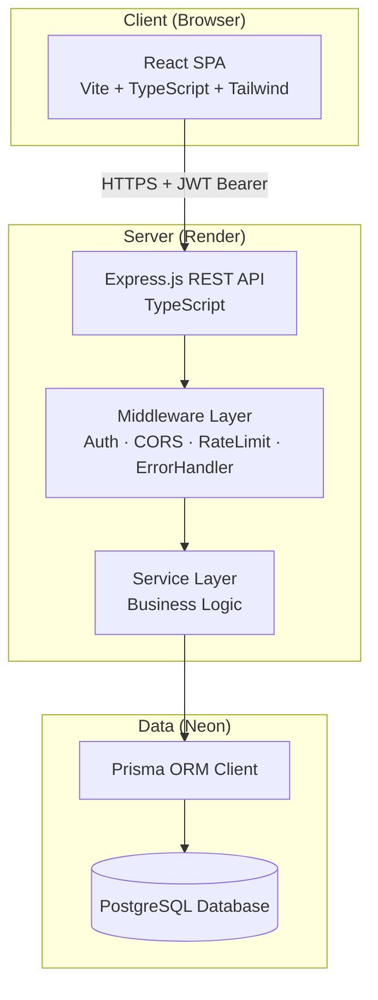
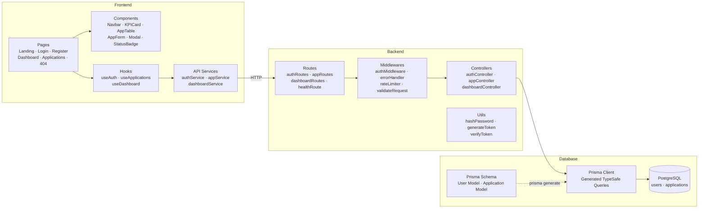
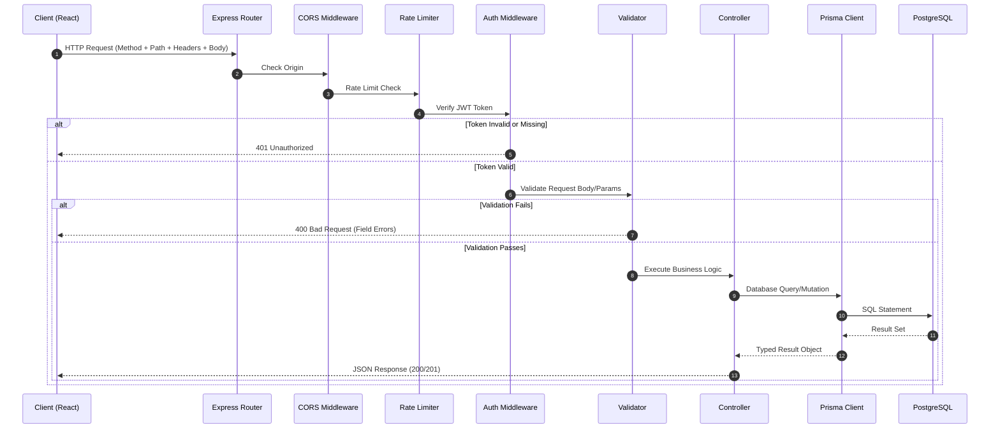
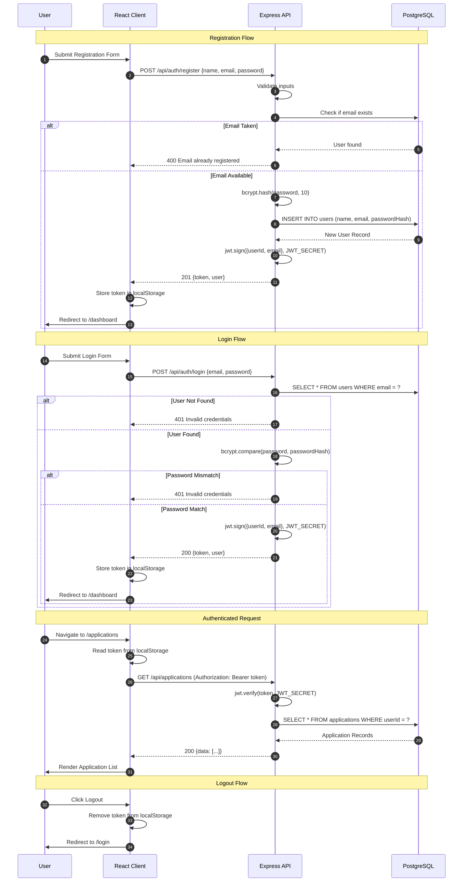

# System Architecture — CareerTrack Lite

## 1. High-Level Architecture

CareerTrack Lite follows a **decoupled client-server architecture**. The React SPA communicates with the Express REST API over HTTPS. The API server manages authentication, business logic, and data persistence through Prisma ORM connected to PostgreSQL.

## 2. Component Diagram

## 3. Request Lifecycle

Every API request follows a deterministic pipeline through the Express middleware stack.

## 4. Authentication Lifecycle

## 5. Data Flow

```mermaid
graph TD
    subgraph "Write Path (Create/Update/Delete)"
        W1[User submits form] --> W2[Client validates fields]
        W2 --> W3[POST/PATCH/DELETE to API]
        W3 --> W4[Auth middleware extracts userId]
        W4 --> W5[Controller validates body]
        W5 --> W6[Prisma executes mutation]
        W6 --> W7[PostgreSQL commits transaction]
        W7 --> W8[Response returned to client]
        W8 --> W9[Client updates local state]
    end

    subgraph "Read Path (List/Detail/Stats)"
        R1[User navigates to page] --> R2[Client sends GET with JWT]
        R2 --> R3[Auth middleware extracts userId]
        R3 --> R4[Controller builds query with userId filter]
        R4 --> R5[Prisma executes SELECT with WHERE userId]
        R5 --> R6[PostgreSQL returns rows]
        R6 --> R7[Controller formats response]
        R7 --> R8[Client renders data]
    end
```

## 6. Key Architectural Principles

| Principle | Implementation |
|-----------|---------------|
| **Data Isolation** | Every database query includes `WHERE userId = req.user.userId`. No cross-user data leakage is possible. |
| **Stateless Auth** | JWT tokens carry identity claims. The server stores no session state. Horizontal scaling requires no session replication. |
| **Layered Separation** | Routes → Middleware → Controllers → Prisma. No layer bypasses another. Controllers never execute raw SQL. |
| **Fail Explicitly** | All controller logic wrapped in try-catch. Errors forwarded to a centralized error handler that returns structured JSON. |
| **Single Source of Schema** | `schema.prisma` is the canonical source of truth for both the database structure and the generated TypeScript types. |
