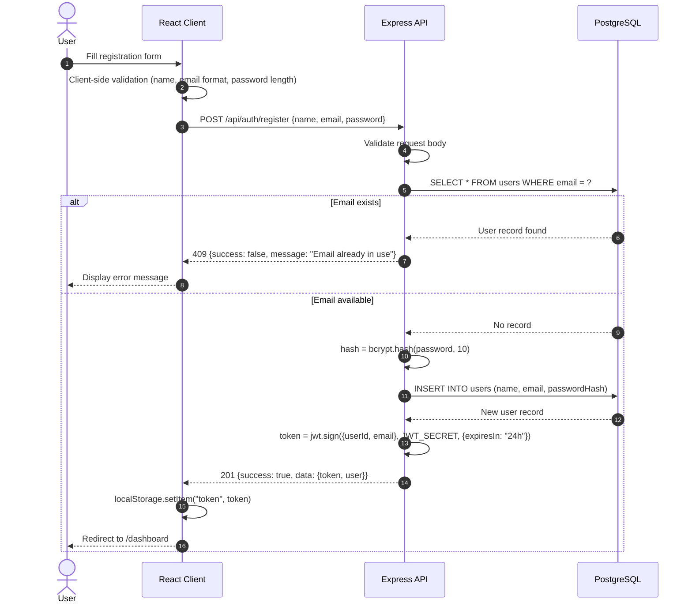
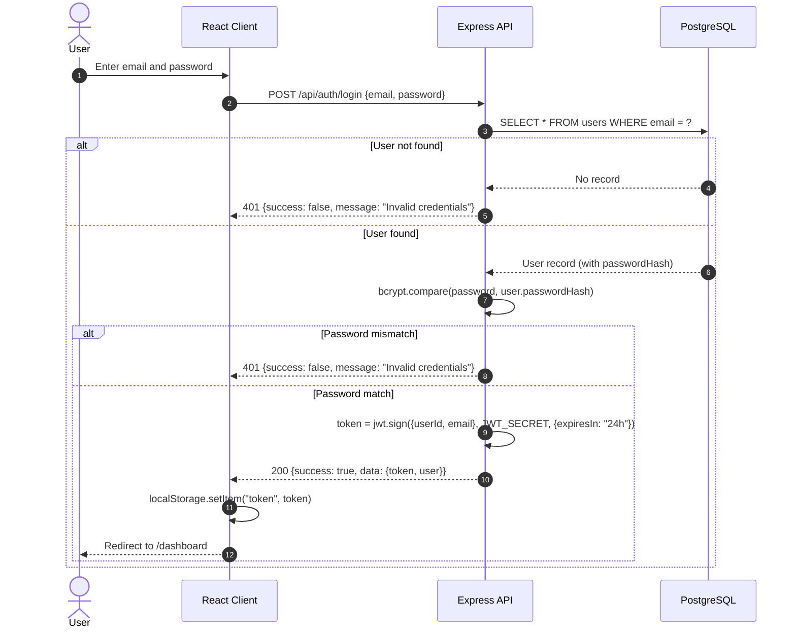
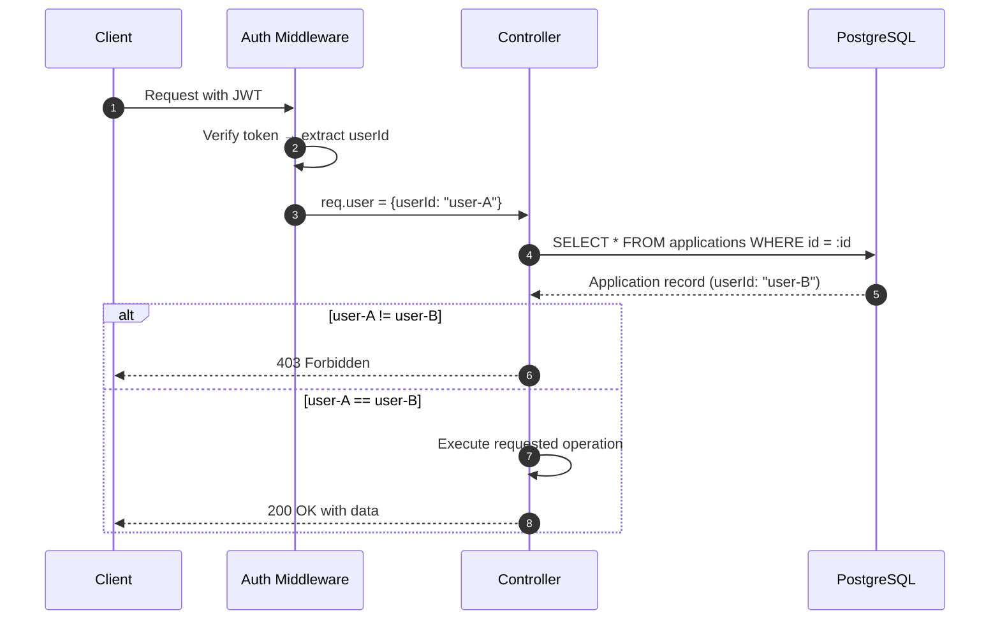
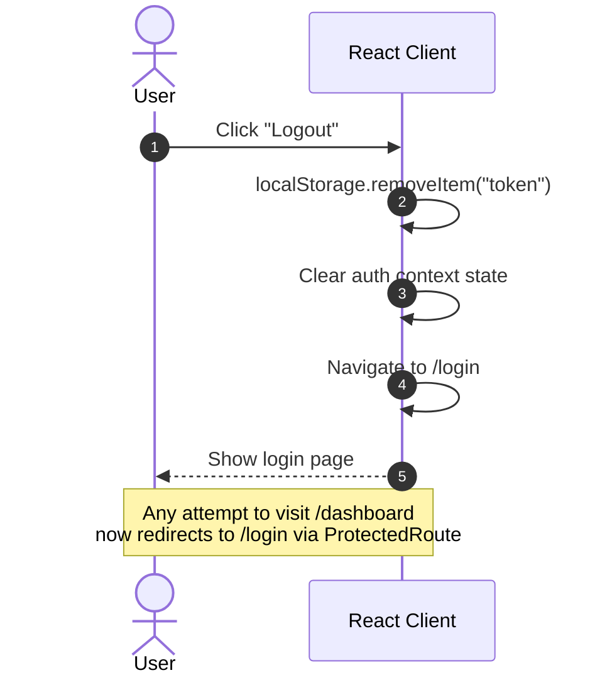
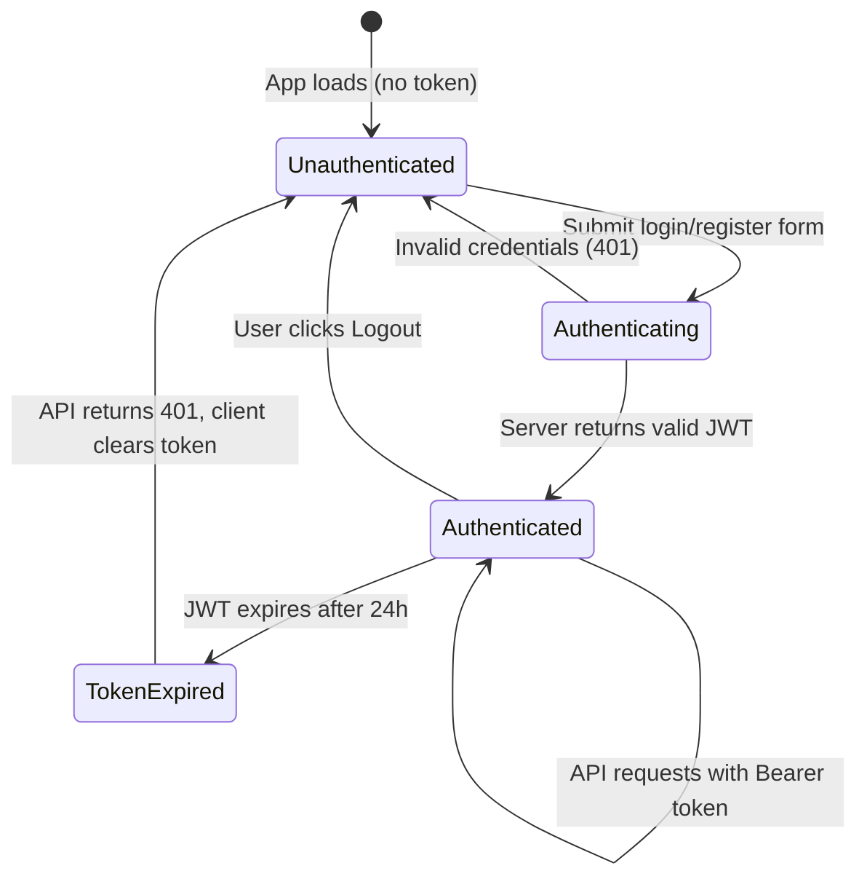

# Authentication & Authorization — CareerTrack Lite

## 1. Overview

CareerTrack Lite uses **stateless JWT-based authentication**. Passwords are hashed with `bcrypt` before storage. The server issues a signed JWT on successful login or registration. The client stores the token and sends it with every subsequent request. The server never stores session state — all identity information is embedded in the token.

## 2. Registration Flow

### Process
1. Client sends `POST /api/auth/register` with `{ name, email, password }`.
2. Server validates input (format, length, required fields).
3. Server checks if email already exists in the database.
4. If email is taken → return `409 Conflict`.
5. Server hashes password using `bcrypt.hash(password, 10)`.
6. Server inserts new user record into `users` table.
7. Server signs a JWT containing `{ userId, email }`.
8. Server returns `201 Created` with `{ token, user }`.
9. Client stores the token and redirects to `/dashboard`.

### Sequence Diagram



## 3. Login Flow

### Process
1. Client sends `POST /api/auth/login` with `{ email, password }`.
2. Server validates input presence.
3. Server queries user by email.
4. If user not found → return `401 Unauthorized` with generic message.
5. Server compares password against stored hash using `bcrypt.compare()`.
6. If mismatch → return `401 Unauthorized` with the same generic message (prevents email enumeration).
7. Server signs a JWT containing `{ userId, email }`.
8. Server returns `200 OK` with `{ token, user }`.
9. Client stores the token and redirects to `/dashboard`.

### Sequence Diagram



## 4. JWT Token Structure

### Header
```json
{
  "alg": "HS256",
  "typ": "JWT"
}
```

### Payload
```json
{
  "userId": "a1b2c3d4-e5f6-7890-abcd-ef1234567890",
  "email": "rahat@example.com",
  "iat": 1753000000,
  "exp": 1753086400
}
```

### Configuration

| Parameter | Value | Rationale |
|-----------|-------|-----------|
| Algorithm | HS256 | Symmetric HMAC — sufficient for single-server deployments |
| Secret | `JWT_SECRET` env var | Minimum 256-bit random string |
| Expiry | 24 hours | Balances security with session UX for a personal tracker |
| Issuer | Not set | Single-app, not required at MVP scale |

## 5. Protected Routes — Backend

### Auth Middleware

The `authMiddleware` function intercepts every request to protected endpoints:

```
1. Extract the Authorization header.
2. Verify format is "Bearer <token>".
3. If missing → respond 401.
4. Decode token using jwt.verify(token, JWT_SECRET).
5. If expired or invalid → respond 401.
6. Attach decoded payload to req.user = { userId, email }.
7. Call next() to pass control to the controller.
```

### Protected Endpoint Map

| Route | Method | Auth Required |
|-------|--------|---------------|
| `POST /api/auth/register` | POST | No |
| `POST /api/auth/login` | POST | No |
| `GET /api/health` | GET | No |
| `GET /api/auth/me` | GET | **Yes** |
| `POST /api/applications` | POST | **Yes** |
| `GET /api/applications` | GET | **Yes** |
| `GET /api/applications/:id` | GET | **Yes** |
| `PATCH /api/applications/:id` | PATCH | **Yes** |
| `DELETE /api/applications/:id` | DELETE | **Yes** |
| `GET /api/dashboard/stats` | GET | **Yes** |

### Middleware Application

```typescript
// routes/applications.ts
router.use(authMiddleware); // All routes below require valid JWT

router.post("/", createApplication);
router.get("/", listApplications);
router.get("/:id", getApplication);
router.patch("/:id", updateApplication);
router.delete("/:id", deleteApplication);
```

## 6. Protected Routes — Frontend

### Route Guard Component

A `ProtectedRoute` wrapper checks for a stored token before rendering child components:

```
1. Check if token exists in localStorage.
2. If no token → redirect to /login.
3. If token exists → render the child route component.
4. Optionally: call GET /api/auth/me to validate token is still valid.
```

### Frontend Route Map

| Path | Component | Guard |
|------|-----------|-------|
| `/` | LandingPage | Public |
| `/login` | LoginPage | Public (redirect to /dashboard if logged in) |
| `/register` | RegisterPage | Public (redirect to /dashboard if logged in) |
| `/dashboard` | DashboardPage | **Protected** |
| `/applications` | ApplicationsListPage | **Protected** |
| `/applications/new` | ApplicationFormPage | **Protected** |
| `/applications/:id` | ApplicationDetailPage | **Protected** |
| `/applications/:id/edit` | ApplicationFormPage | **Protected** |
| `*` | NotFoundPage | Public |

## 7. Authorization Rules (Ownership Enforcement)

Authentication proves *who* the user is. Authorization proves *what* they can access.

### Rules
1. Every `applications` database query **must** include `WHERE userId = req.user.userId`.
2. For single-resource endpoints (`GET /:id`, `PATCH /:id`, `DELETE /:id`), the controller must:
   - Fetch the application by ID.
   - Compare `application.userId` against `req.user.userId`.
   - If mismatch → return `403 Forbidden`.
3. Users cannot access, modify, or delete another user's applications under any circumstances.

### Authorization Flow



## 8. Logout Flow

CareerTrack Lite uses **client-side logout** only. Since JWT is stateless, there is no server-side session to invalidate.

### Process
1. User clicks "Logout" button in the navbar.
2. Client removes the token from `localStorage`.
3. Client clears any cached user state (React state/context).
4. Client redirects to `/login` (or `/`).
5. Subsequent API calls fail with `401` since no token is sent.

### Sequence Diagram



## 9. Session Lifecycle Summary



## 10. Security Considerations

| Concern | Mitigation |
|---------|------------|
| **Password storage** | bcrypt with 10 salt rounds. Raw passwords never stored or logged. |
| **Token theft** | Use HTTPS in production. Token stored in localStorage (cookie with `httpOnly` is a future upgrade). |
| **Brute force login** | Rate limiting on `/api/auth/login` (e.g., 10 attempts per 15 minutes per IP). |
| **Email enumeration** | Login returns identical `"Invalid credentials"` message for both unknown email and wrong password. |
| **Token expiry** | 24-hour expiry forces re-authentication daily. |
| **Ownership bypass** | Every resource query enforces `userId` check at the controller level. |

> **ASSUMPTION (marked):** JWT expiry is set to 24 hours. The specification does not define a specific duration, so this is chosen as a reasonable default for a personal tracker. Adjustable via the `JWT_EXPIRY` environment variable.
