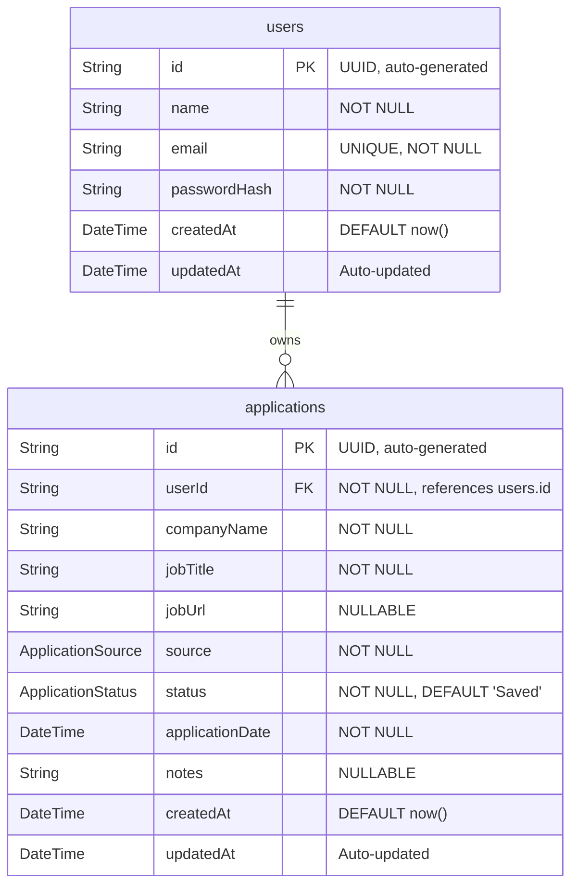

# Database Architecture — CareerTrack Lite

## 1. Entity-Relationship Diagram



## 2. Relationships

| Relationship | Type | Description |
|-------------|------|-------------|
| `users` → `applications` | One-to-Many | A single user can own zero or more job applications. Each application belongs to exactly one user. |

**Referential Integrity:** Deleting a user cascades to delete all their applications (`onDelete: Cascade`).

## 3. Table Definitions

### `users`

| Column | Type | Constraints | Description |
|--------|------|-------------|-------------|
| `id` | UUID | PRIMARY KEY, DEFAULT `gen_random_uuid()` | Unique user identifier |
| `name` | VARCHAR(255) | NOT NULL | User's display name |
| `email` | VARCHAR(255) | NOT NULL, UNIQUE | Login credential; case-insensitive index recommended |
| `passwordHash` | VARCHAR(255) | NOT NULL | bcrypt-hashed password (60 chars) |
| `createdAt` | TIMESTAMPTZ | NOT NULL, DEFAULT `now()` | Registration timestamp |
| `updatedAt` | TIMESTAMPTZ | NOT NULL, auto-updated | Last profile modification timestamp |

### `applications`

| Column | Type | Constraints | Description |
|--------|------|-------------|-------------|
| `id` | UUID | PRIMARY KEY, DEFAULT `gen_random_uuid()` | Unique application identifier |
| `userId` | UUID | NOT NULL, FOREIGN KEY → `users.id` ON DELETE CASCADE | Owner reference |
| `companyName` | VARCHAR(255) | NOT NULL | Target company name |
| `jobTitle` | VARCHAR(255) | NOT NULL | Position title |
| `jobUrl` | TEXT | NULLABLE | Link to the job posting |
| `source` | ENUM | NOT NULL | Origin channel of the application |
| `status` | ENUM | NOT NULL, DEFAULT `'Saved'` | Current pipeline stage |
| `applicationDate` | DATE | NOT NULL | Date the user applied |
| `notes` | TEXT | NULLABLE | Free-form notes about the application |
| `createdAt` | TIMESTAMPTZ | NOT NULL, DEFAULT `now()` | Record creation timestamp |
| `updatedAt` | TIMESTAMPTZ | NOT NULL, auto-updated | Last modification timestamp |

### Enum Types

**`ApplicationSource`**
```
LinkedIn | Bdjobs | Indeed | Wellfound | Facebook | Referral | Other
```

**`ApplicationStatus`**
```
Saved | Applied | Assessment | Interview | Rejected | Offer
```

## 4. Indexes

| Index Name | Table | Columns | Type | Rationale |
|-----------|-------|---------|------|-----------|
| `users_email_key` | `users` | `email` | UNIQUE | Fast lookup during login; prevents duplicate registrations |
| `applications_userId_idx` | `applications` | `userId` | B-TREE | Every query filters by `userId`; critical for performance |
| `applications_status_idx` | `applications` | `userId, status` | COMPOSITE B-TREE | Dashboard stats aggregate by status per user |
| `applications_source_idx` | `applications` | `userId, source` | COMPOSITE B-TREE | Filter-by-source queries |
| `applications_createdAt_idx` | `applications` | `userId, createdAt` | COMPOSITE B-TREE | Sort by newest/oldest and "recently added" dashboard query |
| `applications_appDate_idx` | `applications` | `userId, applicationDate` | COMPOSITE B-TREE | Sort by application date |

## 5. Constraints

| Constraint | Table | Rule | Enforcement |
|-----------|-------|------|-------------|
| **PK** | `users`, `applications` | UUID primary key | Database |
| **UNIQUE email** | `users` | One account per email address | Database + Application |
| **FK userId** | `applications` | Must reference valid `users.id` | Database (CASCADE on delete) |
| **NOT NULL required fields** | Both | `name`, `email`, `passwordHash`, `companyName`, `jobTitle`, `source`, `status`, `applicationDate` | Database + Application validation |
| **ENUM membership** | `applications` | `source` and `status` must match defined enum values | Database (Prisma enum) |

## 6. Prisma Schema

```prisma
// prisma/schema.prisma

generator client {
  provider = "prisma-client-js"
}

datasource db {
  provider = "postgresql"
  url      = env("DATABASE_URL")
}

enum ApplicationSource {
  LinkedIn
  Bdjobs
  Indeed
  Wellfound
  Facebook
  Referral
  Other
}

enum ApplicationStatus {
  Saved
  Applied
  Assessment
  Interview
  Rejected
  Offer
}

model User {
  id           String        @id @default(uuid())
  name         String
  email        String        @unique
  passwordHash String
  createdAt    DateTime      @default(now())
  updatedAt    DateTime      @updatedAt
  applications Application[]

  @@map("users")
}

model Application {
  id              String            @id @default(uuid())
  userId          String
  companyName     String
  jobTitle        String
  jobUrl          String?
  source          ApplicationSource
  status          ApplicationStatus @default(Saved)
  applicationDate DateTime          @db.Date
  notes           String?
  createdAt       DateTime          @default(now())
  updatedAt       DateTime          @updatedAt

  user User @relation(fields: [userId], references: [id], onDelete: Cascade)

  @@index([userId])
  @@index([userId, status])
  @@index([userId, source])
  @@index([userId, createdAt])
  @@index([userId, applicationDate])
  @@map("applications")
}
```

## 7. Migration Strategy

### Initial Migration

```bash
# Initialize Prisma in the project
npx prisma init

# After defining schema.prisma, create and apply the first migration
npx prisma migrate dev --name init

# Generate the Prisma Client for TypeScript
npx prisma generate

# Inspect data with Prisma Studio
npx prisma studio
```

### Migration Workflow

1. **Modify** `schema.prisma` to reflect schema changes.
2. **Generate Migration:** `npx prisma migrate dev --name <descriptive-name>`.
3. **Review:** Inspect the generated SQL in `prisma/migrations/<timestamp>_<name>/migration.sql`.
4. **Apply to Production:** `npx prisma migrate deploy` (runs pending migrations without generating new ones).
5. **Regenerate Client:** `npx prisma generate` to update TypeScript types.

### Migration Naming Convention

Use descriptive, lowercase, hyphenated names:
- `init` — Initial schema creation
- `add-application-notes-field` — Adding a new column
- `add-source-enum-value` — Extending an enum

### Production Safety Rules

- Never use `prisma migrate dev` in production. Use `prisma migrate deploy`.
- Always back up the database before running production migrations.
- Test migrations against a staging database before applying to production.
- Never manually edit migration SQL files after they have been applied.

### MongoDB Fallback Notes

If PostgreSQL proves infeasible and MongoDB is chosen as a fallback:
- Replace `datasource.provider` with `"mongodb"`.
- Replace `@default(uuid())` with `@default(auto()) @map("_id") @db.ObjectId`.
- Remove `@@map()` directives (MongoDB uses collection names matching model names by default).
- Enums must be validated at the application layer since MongoDB does not enforce them natively.
- Document the migration reason in the demonstration video as required by the spec.
