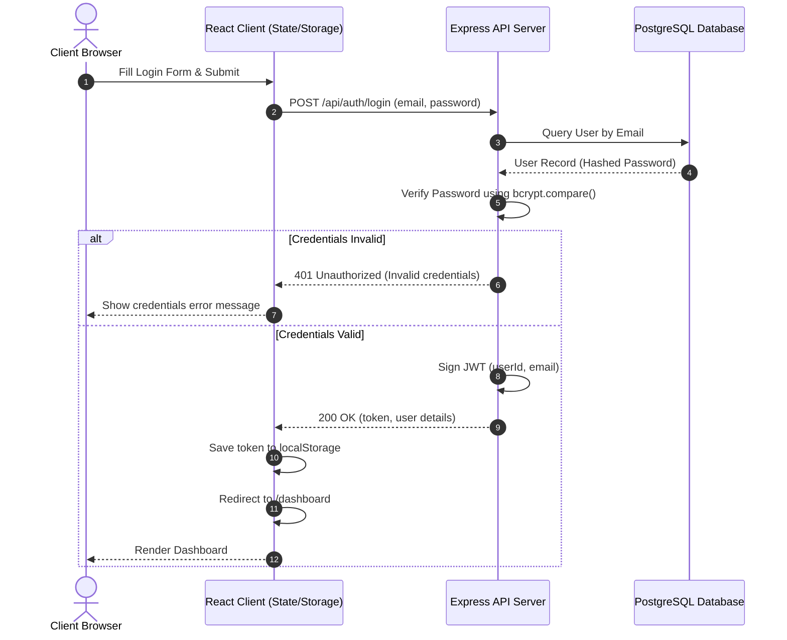
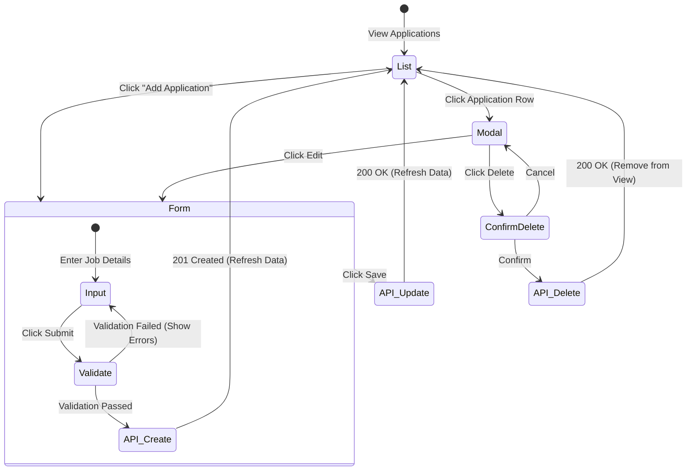
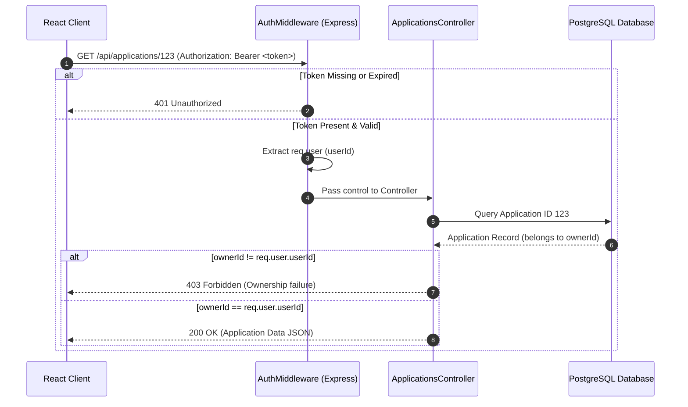
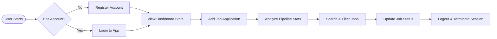

# Application Flow & Diagrams — CareerTrack Lite

## 1. Navigation Flow Map
This diagram maps out the client-side routes, showing public pages vs. protected pages guarded by the JWT authentication layer.

```mermaid
graph TD
    %% Routes
    Landing[/Landing Page /] -->|Click Login| Login[Login Page /login]
    Landing -->|Click Register| Register[Register Page /register]
    
    %% Guard
    subgraph Protected Area
        Dashboard[Dashboard /dashboard]
        AppList[Applications /applications]
        AppForm[Add/Edit Form /applications/form]
        Details[Application Details /applications/:id]
        Stats[Stats /stats]
    end

    Login -->|Success| Dashboard
    Register -->|Success| Dashboard

    Dashboard --> AppList
    Dashboard --> AppForm
    AppList --> Details
    AppList --> AppForm
    AppForm -->|Save/Cancel| AppList
    
    %% Exits
    Protected Area -->|Click Logout| Landing
    AnyPath[Any Unknown Path] --> 404[404 Page]
```

---

## 2. Authentication Flow Lifecycle
This sequence diagram details the login process, showing how JWT is exchanged and cached, and how it is used for subsequent requests.



---

## 3. Application CRUD Process Flow
This state diagram illustrates the creation, modification, and deletion of job applications, validating data boundaries and backend responses.



---

## 4. Protected Route Request Authorization
How the backend intercepts and authorizes incoming requests to application endpoints.



---

## 5. End-to-End User Journey Loop
A map of the path a user takes from entering the app to adding, analyzing, and logging out.


